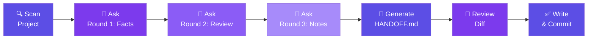

<p align="center">
  <picture>
    <source media="(prefers-color-scheme: dark)" srcset="https://img.shields.io/badge/Claude%20Code-Skill-5C4EE5?logo=anthropic&logoColor=white&labelColor=1a1a2e">
    
  </picture>
  
  
</p>

<h1 align="center">handoff</h1>

<p align="center">
  <strong>From "what's this project about?" to "let's ship"<br/>— context handoff in under 2 minutes.</strong>
</p>

<p align="center">
  <a href="README.zh-CN.md">中文文档</a>
  &nbsp;·&nbsp;
  <a href="#install">Install</a>
  &nbsp;·&nbsp;
  <a href="#quick-start">Quick Start</a>
  &nbsp;·&nbsp;
  <a href="#how-it-works">How It Works</a>
</p>

---

## What is it?

`handoff` is a **Claude Code Skill** that auto-generates a structured `HANDOFF.md` for any project. When you start a new session, Claude reads this file and understands your project instantly — no re-explaining, no wasted tokens.

> The problem: every new Claude Code session starts with zero context. You burn time and tokens explaining your project from scratch.
>
> The solution: a single `HANDOFF.md` that captures the essential facts — machine-enforced structure, human-confirmed content.

---

## Why?

<table>
<tr><th>Pain Point</th><th>How handoff fixes it</th></tr>
<tr><td>Re-explaining your project in every session</td><td>7 fixed sections, readable in under <strong>2 minutes</strong></td></tr>
<tr><td>Verbal explanations eat into the context window</td><td>One file carries all the essential facts — <strong>zero token waste</strong></td></tr>
<tr><td>Team knowledge scattered across different minds</td><td>Facts written to a file — anyone who opens it is <strong>instantly aligned</strong></td></tr>
<tr><td>Stale information as the project evolves</td><td>One-command re-scan picks up the latest state, <strong>preserves user judgments</strong></td></tr>
</table>

---

## Core Design

### The 3 Principles

| Principle | Meaning |
|---|---|
| **Short** | 7 sections, each ≤ 5 lines. Read in 2 minutes. |
| **Accurate** | Every claim traceable to a commit, issue, or `file:line`. No guesses. |
| **Repeatable** | Stable across runs. It scans code + asks you. No hallucination. |

### The 7 Sections

A `HANDOFF.md` always has the same structure:

| # | Section | What goes in |
|:-:|---|---|
| 1 | **Identity** | What the project is, who it's for, core value |
| 2 | **Tech Stack** | Each layer's choice + rationale (table) |
| 3 | **Structure** | Directory tree, depth ≤ 2 |
| 4 | **Data Model** | ER-level — entities + relationships |
| 5 | **Key Decisions** | Each with commit hash / issue link / code coordinate |
| 6 | **Startup & Verification** | Startup commands + the human-confirmed success indicator |
| 7 | **Pitfalls** | "Don't do X, because Y" |

---

## How It Works



### The 3-Round Dialogue

This is what makes handoff different from simply dumping a prompt:

| Round | Action | Why it matters |
|:---:|---|---|
| **1** | Confirm scanned facts, fill in identity, pitfalls, and the success indicator | The machine can scan code, but it can't know *why you wrote it that way* |
| **2** | Review old decisions & pitfalls — batch keep, modify, or delete | Some entries go stale as the project evolves |
| **3** | Confirm the manual notes section | User-curated notes are **never auto-overwritten** |

---

## Install

```bash
npx skills add aIeXCai/handoff
```

---

## Quick Start

```bash
cd your-project
/handoff
```

That's it. The skill scans your repo, asks you 3 rounds of questions, and writes `HANDOFF.md` at the project root.

Or say it in chat: *"write a handoff"* / *"更新 HANDOFF"*

### When to run it

- **Long session nearing the context limit** — save the project state before it's compressed away
- **Starting a fresh session** — get aligned instantly by reading the existing `HANDOFF.md`
- **Big structural changes** — re-scan to reflect the new reality
- **New teammate onboard** — they get a complete picture in 2 minutes

---

## Example Output

Here's a real `HANDOFF.md` generated for a WeChat mini-program:

```markdown
## 1. Identity
Grit Mini-App — a workout logging tool for CrossFit/Hyrox enthusiasts.
Core value: structured plans + subjective feedback replace messy fitness logs.

## 2. Tech Stack
| Layer      | Choice                       | Rationale                           |
|------------|------------------------------|-------------------------------------|
| Frontend   | WeChat Native + WXML         | Mini-program ecosystem default      |
| Backend    | WeChat Cloud Development     | Serverless, CloudBase integration   |
| Data       | CloudBase Document DB        | Native integration with cloud funcs |

## 3. Structure
src/
├── pages/          # Pages
├── components/     # Shared components
├── utils/          # Utility functions
└── cloudfunctions/ # Cloud functions

## 4. Data Model
- User → Checkin: one-to-many
- Plan → Exercise: one-to-many

## 5. Key Decisions
- Embed checkin as single doc, not sub-collection → commit a3f2b1c
- Lazy-create checkin records → src/utils/checkin.js:42
- Separate subjective feedback from workout data → issue #47

## 6. Startup & Verification
- `npm run dev` → Open in WeChat DevTools → Home page shows the plan list

## 7. Pitfalls
- Don't manually modify checkin's `date` field → CloudBase triggers depend on its index
- Don't run heavy queries inside `onShow` → fires on every page switch
- Don't use `wx.navigateTo` for deep stacks → use `wx.redirectTo` after level 5

## Manual Notes
<!-- handoff:manual-zone -->
The auth flow depends on WeChat's `wx.login()` returning an ephemeral code.
If testing in DevTools, use the "Skip Auth" toggle in settings.
<!-- /handoff:manual-zone -->
```

---

## vs. Alternatives

| | handoff | README.md | CLAUDE.md | Verbal Briefing |
|---|---|---|---|---|
| **Maintained by** | AI + human review | Human | Human | Human |
| **Update cadence** | One command | Occasional | Manual | Every session |
| **Content type** | Facts, decisions, pitfalls | Project intro | AI behavior rules | Any |
| **Traceability** | Every claim → code coord | Not required | Not required | None |
| **Best for** | AI-assisted dev handoff | Human-facing intro | AI behavior config | One-off context |

---

## License

[MIT](LICENSE)

---

<p align="center">
  <sub>Made for <a href="https://claude.ai/code">Claude Code</a> — the agentic coding CLI from <a href="https://anthropic.com">Anthropic</a>.</sub>
</p>
